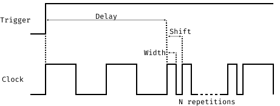

# CW305 Cortex M3 Clock Glitching Data

This repository contains the data for several measurements which were done with
a CW305 FPGA embedding a softcore ARM Cortex M3. All measurements were done on
the following program:

```asm
# Prelude
    mov r4, 0x14
    mov r1, 9
    mov r3, 0x5a
    mov r5, 0xc
    mov r6, r5

# Target Code
# The number before the instruction signifies the delay value.
22: mov r8, r4
23: nop
24: add r1, r1, 0x6
25: add r3, r3, 0xa
26: add r4, r4, 0xb 
27: add r5, r6, r3
28: add r3, r3, 0xf
```

## Parameters



- *width*: the width wave parameter (% of the usual clock period)
- *offset*: *shift* - *width* (% of the usual clock period)
- *width-fine*, *offset-fine*: fine adjustments for the wave parameters (unused)
- *delay*: the delay wave parameter (in number of clock cycles)
- *round index*: the index for the given configuration
- *needed reset*: whether this round needed to reset the core
- *needed reprogram*: whether this round needed to reprogram the FPGA due to corruption
- *R0-R12*: the hexadecimal value of the register. This value is 0 if a reset or reprogram was needed

## Datasets

- `a5-light-parameters.csv`: Tests clock glitching for delay 20-29 with relatively
  tame clock glitching parameters. This is in an old format and thus only the
  amount of resets and reprograms is given at the end of each configuration.
  This does 10_000 measurements rounds per parameter configuration. This uses
  the `A5` pin for the core reset.

- `a5-varied-parameters.csv`: Tests clock glitching for a number of different
  parameter configurations. This does 50 measurements per parameter
  configuration. This uses the `A5` pin for the core reset.

- `a5-no-mov.csv`: Tests clock glitching for a set parameter configuration. This
  removes the `mov` instruction at delay 22. Measurements range from delay
  20-29. This does 10_000 measurements per parameter configuration. This uses
  the `A5` pin for the core reset.

- `t15-light-parameters.csv`: Tests clock glitching for a set parameter
  configuration. Measurements range from delay 20-29. This does 10_000
  measurements per parameter configuration. This uses the `T15` pin for the core
  reset.

- `t15-varied-parameters.csv`: Tests clock glitching for a number of different
  parameter configurations. This does 50 measurements per parameter
  configuration. This uses the `T15` pin for the core reset.